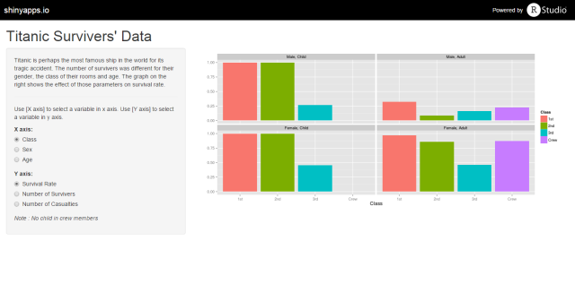

## Introduction


- Titanic is perhaps the most famous ship in the world for its tragic accident. 
- One can easily imagene the priority of saving lives of children and women was higher than that of adults and men. But is that really true?
- To verify that, survival rate of each group was visualized to check the effect of parameters such as their gender, the class of their rooms and age.

---

## How the app looks



- Side panel
 + Brief documentation
 + Choose variables for x and y axis here.
- Main panel
 + Visualized survival rate (or number of survivers or casualties) is shown here.

--- .class #id 

## Titanic raw data

```{r}
str(Titanic)
```

--- .class #id 

## Pre-processing data

Data (4-dimensional array) was "molten" for creating graph.

```{r}
library(reshape2)
t <- melt(Titanic)
t <- dcast(t, Class + Sex + Age ~ Survived)
t <- transform(t, total = No + Yes) 
t <- transform(t, rate = Yes / total)
head(t)
```


